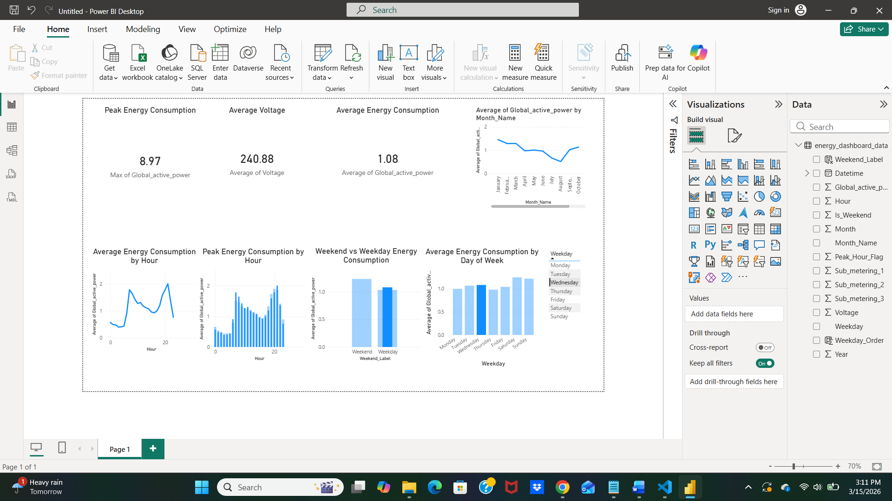

# Smart Energy Consumption Analytics Dashboard

## Project Overview

This project analyzes household electricity consumption data to identify patterns in energy usage. The analysis focuses on understanding peak consumption hours, weekly usage behavior, and seasonal energy trends.

The project demonstrates an end-to-end data analytics workflow including data cleaning, exploratory analysis, and interactive dashboard visualization.

The final result is an interactive **Power BI dashboard** that provides insights into electricity consumption patterns.

---

## Dataset

The dataset used in this project is the **Individual Household Electric Power Consumption Dataset** from the UCI Machine Learning Repository.

It contains more than **2 million records of electricity consumption measurements** including:

- Global Active Power
- Voltage
- Sub-metering values
- Date and time of measurements

---

## Tools and Technologies

This project uses the following tools:

- Python
- Pandas
- Matplotlib
- Power BI
- SQL
- Git & GitHub

---

## Data Processing

The raw dataset was cleaned and transformed using Python.

Key steps included:

- Converting date and time columns into a unified datetime format
- Handling missing values
- Creating analytical features such as:
  - Hour of the day
  - Day of the week
  - Weekend indicator
  - Month and seasonal categories

A cleaned dataset was exported for visualization in Power BI.

---

## Key Insights

### Peak Energy Consumption

Electricity consumption peaks during **evening hours (7 PM – 9 PM)** when household appliance usage is highest.

### Weekend vs Weekday Behavior

Energy consumption tends to be **higher on weekends**, indicating increased household activity.

### Seasonal Trends

Monthly analysis shows **clear seasonal patterns**, with higher consumption during colder months.

### Daily Usage Patterns

Energy consumption is lowest during early morning hours and increases gradually throughout the day.

---

## Power BI Dashboard

The Power BI dashboard visualizes the key insights from the analysis.

Dashboard features include:

- Average energy consumption metrics
- Hourly energy consumption trends
- Day-of-week usage comparison
- Weekend vs weekday analysis
- Monthly energy consumption trends
- Interactive weekday filtering

---

## Dashboard Preview

---

## SQL Analysis

SQL queries used to analyze energy consumption patterns are available in:
sql/energy_analysis.sql

These queries demonstrate how aggregation and grouping can be used to analyze electricity usage patterns.

---

## Project Structure
energy-consumption-analytics
│
├── dashboard
│ └── energy_consumption_dashboard.pbix
│
├── data
│ ├── raw
│ └── cleaned
│
├── images
│ └── dashboard.png
│
├── notebooks
│ └── energy_analysis.ipynb
│
├── sql
│ └── energy_analysis.sql
│
└── README.md

---

## Author

**Shivani Matam**

Master's in Information Technology & Management  
Florida Atlantic University